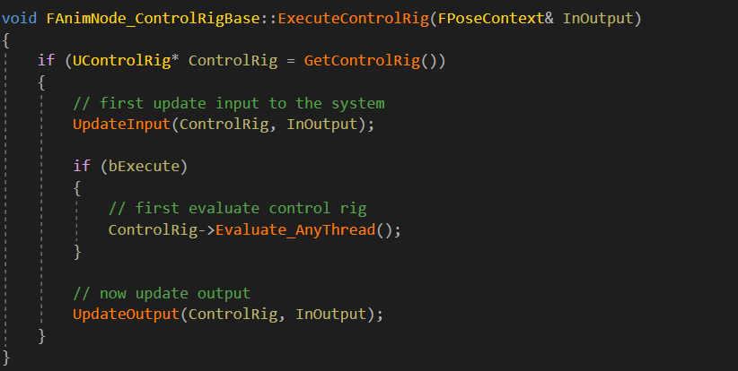
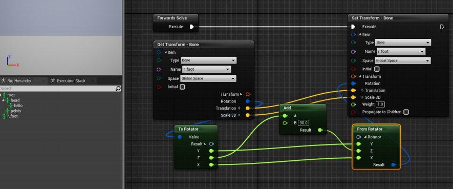

# Control Rig源码分析

{docsify-updated}

> 将21年写的文章搬运过来
（未完待续）
 Control Rig是一个通用的基于节点的动画子系统，其核心是一个骨骼操作约束脚本。可以在根骨骼空间中建立一系列的点或者说Element，通过骨骼名称与外部的Skeleton建立映射关系，从而实现对骨骼的控制和约束。它的Rigging是建立在骨骼上的，其操纵的最小颗粒就是骨骼。所以Control Rig对于一个没有骨骼或者顶点没有绑定到骨骼上的Mesh是没有意义的。

<!-- more -->

 
#  Control Rig的启用和创建
Control Rig作为引擎插件集成在引擎中，在UE4.26版本中默认是关闭的，需要手动去开启

可以用两种方法为骨骼网格体创建Control Rig。第一种方法，右键点击一个骨骼网格体资产，选择 创建Control Rig（Create Control Rig）。这会新建一个 Control Rig 资产并自动将骨骼网格体指定为绑定对象。此资产会自动沿用骨骼网格体的名称，并且以 _CtrlRig 作为名称后缀。
第二种方法是手动创建一个 Control Rig。步骤是在内容浏览器中点击右键，选择 动画（Animation）> Control Rig。在上下文菜单中，选择 ControlRig 并点击 创建（Create）。
创建一个空白的Control Rig资源后，可以在Rig Hierarchy面板中手动import mesh。从这里就可以看到ControlRig不同于以往ue4动画资产的地方，它可以不依赖于USkeleton而独立创建资源。USkeletalMesh在这里是一个Preview Mesh的概念。
从引用关系图可以看到，Control Rig并没有强引用USkeletalMesh和USkeleton。这就可以看到Control Rig可以在不同骨骼角色之间共用的可能性。 后面会说明Control Rig是如何能在不同的骨骼之间工作的。

# Rig Hierarchy
Rig层级（Rig Hierarchy）面板类似于大纲视图，可以查看当前骨架和控制点的层级。这也是新建 骨骼（Bones）、控制点（Controls） 和 空间（Spaces） 的主要区域。要创建这些元素，在面板中点击右键，这是Control Rig中最重要的数据面板。这3种元素都是继承于FRigElement，拥有一个基本的name和index。

对于这三种数据结构，可以分为两类。第一类是Bone，第二类是Control和Spaces
## Bone
Bone是ControlRig对外沟通的桥梁，分为Imported和User两种类型。ImportedBone在Rig Hierarchy中用白色标记，它在从SkeletalMesh创建Control Rig或者手动调用import mesh时生成， 而UserBone是用户在Hierarchy面板中手动创建，用绿色标记。ControlRig的Bone可以看作是一个带有父子关系的transform变量，和传统动画资源Skeleton Tree里的Bone不是一个概念。而且不能挂靠在Control和Space下。UserBone在4.26中推出，在代码中，两者的数据类型都是FRigBone，只有成员变量枚举Type是不同的。

简单来说，**ControlRig是作为中间计算工具，外部将FName相同的骨骼的Transform传进来，内部利用这些数据执行完脚本逻辑后，再拷贝到外部**
## Space
在Rig Hierarchy中用红色标记。Space和Control搭配起来使用，Space在视口中没有可视化标记，也不能在视口中移动。Space可以挂靠在Bone，Control，Space下。它的作用类似于SceneComponent。从代码中可以看到，Control的local transform都是相对于Space的，当Control挂在Space下，该Space可视作Control的原点，它用来组织并变换挂载其下的Controls。

## Control
在Rig Hierarchy中用蓝色小球标记。是在Control Rig文档中介绍得最多的Element。它拥有可在场景中交互的Gizmo可视化形状工具，可以用鼠标操纵这些Gizmo来改变Control的参数。Control可以用多种不同的数据类型表示，越复杂的数据其可控制能力就越强。其最常见的用法就是将Control和某一个Target Bone绑定在一起，用Control的Tranform数据去驱动实际Bone的Transform。

选择合适的可视化Gizmo，可以使得Control的功能更加清晰易懂。例如只想使用Control来控制骨骼的旋转，那么用一个圆环套在身上就非常合适。下面的Control Rig官方示例就很好体现了这个思想。

在Control Rig编辑器的Class Settings可以修改Gizmo Library类，如果有需求可以编写自己的GizmoLibrary来扩展更多的几何可视化工具。

## Control Rig 功能共享的思考
为什么说Control Rig可以在不同骨骼之间共享？因为Control Rig在其内部数据结构中并没有引用或者序列化任何USkeleton或者FRerenceSkeleton对象。而是自己维护了FRigHierarchyContainer结构体，这个结构体由FRigBoneHierarchy，FRigSpaceHierarchy，FRigControlHierarchy，FRigCurveContainer这4个struct构成，这4个struct可以视作对应数据结构（bone, space, control ,curve）的数组。

对这些数据结构进行赋值，计算等一系列操作，对于Control Rig来说都是其内部行为，与外界资源都是独立的。那么引擎的动画模块是如何使用它并与真正的SkeletalMesh建立映射关系呢？关键就是通过骨骼bone的名称FName来完成。当在Sequencer或者动画蓝图里使用Control Rig时，底层的数据交换都是在FAnimNode_ControlRig动画节点里完成。

在该动画节点的CacheBones接口上，获取动画蓝图当前帧引用的RefSkeleton以及ControlRig自己的Rigbone，通过求交集方式获取两个数据结构中名称相同的骨骼并存进哈希表ControlRigBoneMapping。在动画节点的Evaluate接口，首先会调用UpdateInput，把ControlRig动画节点之前计算好的骨骼FPoseContext传进ControlRig内部，然后调用ControlRig的Evaluate_AnyThread接口，进行ControlRig内部本地的骨骼控制约束计算，最后调用UpdateOuput，这里会把ControlRig内部更新的数据结构与实际动画蓝图对应的骨骼数据进行同步，将结果写进FPoseContext。

 可以看到整体逻辑十分简单，动画蓝图将骨骼transform传入controlrig，内部evalutae完成后再传出去。
 UpdateInput和UpdateOutput除了空间上的转换，流程上都是一样的。根据之前缓存好的哈希表，通过骨骼FName来索引。只要Control Rig的BoneHierarchy中的bone名称和外部Skeleton的bone名称相同，那么就能成功将数据传入和传出于Control Rig。

之前提到过Imported bone和User bone的关系。从这里的流程可以看到，两者都作为FRigBoneHierarchy的数据成员在与外部模块进行数据传输时没有任何区别。事实上只要FName匹配，外部的bone数据就能传进Control Rig，内部计算好的数据也能传输出去。

下面是一个ControlRig版本的OrientationWarping实现，首先创建一个新的Control Rig，不选择import任何mesh的骨骼。而是在RigHierarchy自己添加期望改变的userbone，逻辑非常简单，就是旋转root骨骼，然后再反向旋转spine骨骼。然后将其在动画蓝图以节点方式结合起来。整体结构清晰简单，只用一个controlrig节点就替代了以前一堆modify bone节点，然后也能在其他动画蓝图快速复用
还有一点要注意的是，无论是bone, space还是control。它们都有两套transform或者data。拿骨骼来说，bone有InitialTransform和CurrentTransform，两者区别是，InitialTransform是会被序列化, CurrentTraansform则是运行时的临时数据。因为ControlRig是一个独立资源，所以它的所有Rig数据都是可以被更改的。当我们使用Sequencer或者动画蓝图ControlRig节点时，当勾选节点的SetRefPoseFromSkeleton功能时，节点会在初始化时用AnimInstance引用的FRerenceSkeleton来初始化RigBone的initial数据。使得Control Rig可以自动适应不同骨骼（高矮胖瘦）

但是Space和Control就需要我们手动去设置了，这也是Setup event的主要功能。

# Rig Graph
Rig图表是编写Control Rig行为脚本的主要位置。类似于蓝图编辑器EventGraph和动画蓝图编辑器AnimGraph的结合。既然是编写脚本，那么就需要脚本执行入口。在4.26，目前提供了3种不同的脚本逻辑入口，下面会一一介绍。首先要说明的是，Rig Graph中所有的节点都是FRigUnit，这3种脚本入口同样也是RigUnit。分别是
- Setup event       -  FRigUnit_PrepareForExecution
- Forwards Solve    -  FRigUnit_BeginExecution
- Backwards Solve   -  FRigUnit_InverseExecution

这3个Unit的结构除了static变量EventName，其它几乎一模一样。这3者的区别就是被引擎调用的时机。

## Setup Event
可以用来初始化Control的Transform包括平移，旋转，缩放。该功能在4.26新出现，前面说过Control Rig在不同USkeleton上运行时，会有适配问题。Bone在初始化时候会自动适配，而Control就需要自己来调整了。那么SetupEvent就出现了，除了特殊的编辑器预览模式下，该event在整个生命周期只会运行一次，可以理解为Actor的BeginPlay事件。

## Forwards Solve
是Control Rig最常用的逻辑入口，在4.26之前的ControlRig只有这一个逻辑入口。在UControlRig的构造函数中会默认向EventQueue添加BeginExecution，然后ControlRig在每一帧的Evalutae_AnyThread都会去执行Forwards Solve对应的逻辑。可以类比为Actor的Tick事件。这是任何Control Rig脚本都应该去编写的逻辑

## Backwards Solve
这是4.26添加的新功能。其主要对应的功能就是Sequencer的BakeToControlRig功能，其功能是将一段选中的骨骼动画序列执行InverseExecution逻辑，一般为了获取Rig Graph中的Control数据，会对选中的AnimSequence的每一帧都去执行Backwards solve，从而得到每一帧中bone对应的Control Transform。
该事件在4.26版本中只能在编辑器模式下制作Sequencer时去手动调用它。而且一定要在Control Rig里面定义了Backwards Solve，才能在该下拉列表里搜索到对应资源。暂时还没有找到其他调用入口。 
 
 从代码中可以看到，这里会遍历动画数据的每一帧，并执行InverseExecution来获取这一frame下的Control Transform。在官方给出的Control Rig demo示例中主要是针对Sequencer制作动画的，所以BackwardsSolver写得很多。但如果只是想将Control Rig用在Runtime的游戏流程中，那么是完全不需要去管Backwards Solver的。
 
 # Sequencer使用
 Control Rig最初的宣传就是改善Sequencer流程，也是Epic在最近几个引擎版本更新中大力更新发展的。当把一个ControlRig资源直接拖到场景，会自动创建一个levelSequence。在Sequencer中通过Control Rig的Control Gizmo工具可以细致地控制每一个Character骨骼的每一个关节，然后添加关键帧。
 
 直接在UE4的场景里制作动画，可以让很方便地让角色和关卡场景中的物体互动，以前可能需要将椅子或者场景模型倒进maya这样的DCC软件，重新制作动画后再导出。现在只要制作的Control Rig足够精细，可以轻松操控模型的各个关节，那么就有可能制作出非常细腻真实的动画效果，具体可以去看虚幻官方商城里的Meerkat演示demo，里面的动画都是由Control Rig和Sequencer一起完成的。也可以直接做出一段精细的动画然后将其保存为AnimSequence。
 
 这里将一段现有的动画资源通过Sequencer，bake成ControlRig数据，然后调整头部Control的Rotation曲线，修改了动画最后将其保存成AnimSequence。
 
 # 动画蓝图 和 Control Rig
 ControlRig在GamePlay中最直接的运用就是在动画蓝图的骨骼后处理阶段替代之前的SkeletalControl节点，然后在Control Rig里面是对骨骼做约束和变换。古代山谷提供了脚部ik示例，做Ik需要解算器Effector的location，有两种方式可以获取。第一种是在Control Rig里面声明变量，将其公开就可以在AnimGraph来传值，所以数据的传递流程就是从角色actor到动画蓝图最后再到Control Rig；第二种方式是直接在Rig Graph里面做碰撞检测，这是4.26新添加的功能。相比来说更加方便，省去数据在不同BP传输的过程。
  可以看到目前Control Rig内部支持的Trace比较简单，返回的信息比较少，如果需求复杂可能还是要使用第一种方法。对比以往在动画蓝图的AnimGraph中进行骨骼后处理，使用Control Rig本质上并没有太多区别。本质上都是对骨骼做变换，区别是动画蓝图是直接操作FRerenceSkeleton的骨骼数据，而ControlRig是从外部接受数据，内部计算，再映射回外部。
 
 两者最终达成的效果都是一致的，更多的是工作流上的不同。ControlRig会更加独立，具有低耦合的特性。
 
 这是UE4 Paragon项目中角色的AnimGraph结构。可以看到一个大型商业游戏角色的AnimGraph非常复杂，从动画数据的采样混合，各种locomotion状态的转变，动画偏移，分层动画蒙太奇再到后处理。AnimGraph几乎大包大揽地完成了动画计算的整个pipeline，而ControlRig主要的工作就是替代流程中的Post-Processing部分，一般来说动画的后处理模块也是相对比较独立的，将其转移到Control Rig使得它能够在不同骨骼角色之间也能共用（FF7 Remake就是采用了这种思路）。

另外在官方的文档中提到Control Rig是采用了一个轻量级的VM虚拟机，执行速度会比传统蓝图节点更快一些。

上面是Epic日本官方给出的数据，实际的运行效率还有待测试。

 # ControlRigComponent
 该功能在4.26新增加的，文档比较少，这里简单说一下其功能。这个组件声明了一个ControlRig对象的StaticClass。在RegisterComponent的时候动态生成UControlRig。然后在TickComponent 函数里调用ControlRig的Evalutae接口。我们知道ControlRig内部计算是独立的，如果不与外部数据建立映射关系，那么是不会有任何作用的。这个组件通过Add Mapped Skeletal Mesh与实际 mesh建立关系。
 通过Sequencer和动画蓝图节点方式的去链接是编辑器下的行为，而这个函数是可以runtime去调用的。但是映射关系建立后，如果这个Mesh的AnimInstance不是Sequencer Instance。那么其动画蓝图类就会被强制改写为UControlRigAnimInstance。所以不应该对runtime的主控角色或者有动画资源的mesh进行映射，这会丢失动画蓝图所有的状态逻辑。
在映射的过程中，会把SkeletalMesh的所有bone和curve都作为FControlRigComponentMappedElement添加到MappedElements数组中，后续操作都是在该数组上进行的。ControlRigComponent里面对数据进行了重新划分定义，定义了新的结构体FControlRigComponentMappedElement。通过在原本的数据结构上封装了一层， 通过TransformName，ElementName和Direction。就可以让ControlRig在不同名称骨骼的之间共用。同时还定义了ComponentReference和Direction，这样让数据的进入和进出更加有灵活性。

ControlRigComponent在ControlRig执行Evalutae前会调用UControlRigComponent::TransferInputs()，这个阶段会遍历所有Direction为Input的MappedElement，将这些数据送进ControlRig内部。利用这个特性可以方便地实现一些GamePlay功能，比如将某个Actor某个SceneComponent传进去作为根骨骼的位置。

而在这一帧的ControlRig执行完毕后，会调用UControlRigComponent::TransferOutputs()。这里会把ControlRig里的数据传出到外部，同样地遍历所有Direction为Output的MappedElement，获取它们的transform。然后根据映射元素的类型，将这些transform赋值给动画蓝图的storedTransforms或者外部的ComponentReference。

这样通过建立映射，就能将ControlRig的一些内部transform数据传递给外部的Component。

之前的Sequencer和动画蓝图，在底层使用Control Rig的方式都是通过FAnimNode_ControlRig动画节点的方式。但是ControlRigComponent则是不使用动画节点，而是直接将ControlRig里的数据写进UAnimInstance。可以看到这个AnimInstance非常简单，ControlRigComponent会直接把更新后的数据写进两个public的Stored变量。

然后在Evaluate接口里直接将两个Stored TMap赋值给FPoseContext。最后手动调用SkeleMeshComponent更新骨骼渲染数据的接口。
在这个UAnimInstance里面，抛弃了传统的动画节点树，选择直接将数据写入PoseContent。这里的AnimInstance只是个中转站，负责将ControlRig更新后的骨骼数据通过传统的动画更新方式传入渲染线程中。这是一个非常激进的改变，因为这个UAnimInstance使用不了任何动画节点，也就失去播放现有动画，混合动画的能力。
因为ControlRigComponent没有使用动画蓝图节点，那么当其要在不同的SkeletalMesh上共享时，需要手动调用接口SetInitialBoneTransform来完成bone的初始化流程。一般都是在OnPreSetup事件中去初始化bone
然后在Control Rig的Setup event利用初始化的bone去初始化control。

当使用ControlRigComponent时，如果是运用在Runtime GamePlay中，那么应该考虑将其作为完全程序化动画的一种实现方案，因为当其添加对USkeletalMesh的映射时，会重新设置其AnimClass，并让ControlRig完全控制骨骼，那么就失去了使用现有动画资源的能力。
 # 动画蓝图节点映射
 既然ControlRig是一个独立的运算系统，ControlRigComponent在其基本数据结构上做了一层映射，使得能够在不同名称骨骼的骨架上共享，那么动画蓝图节点完全也可以这么做。在目前4.26 的版本中，ControlRig动画节点并没有提供映射功能，但是在源码中可以看到已经有了映射功能的代码，但是还没有开放给用户使用，经过简单测试，还是有很多bug并不能正常使用。但是从 代码中可以看到Epic官方对mapping的思路，通过FName和FProperty能够支持不同类型变量的映射

但是目前这个功能是未完成的状态，我们可以利用这个思路自己尝试一下。首先在动画节点头文件中添加变量UserMappingBone用于开发者自定义映射骨骼，以及TMap变量BoneNameToIndexLUT来通过名称来快速获得骨骼索引。

在节点的CacheBone接口，将骨骼名称对应的Index存储起来，避免每次update都需要查询。
然后在UpdateInput中，在原本的基础下添加对UserMappingBone的映射处理，将映射的transform写进ControlRig
对于UpdateOutput处理会特别一点，因为ControlRig数据写入PoseContext后需要做空间上的转换，所以不能调用Super父类，而是应该将整个父函数复制过来然后添加自己的逻辑。这样保证 transform数据在变换空间上的一致性。 然后可以简单测试一下功能，创建一个简单的ControlRig资源，因为测试动画蓝图引用的骨骼是标准的小白人，这里自定义一个骨骼并将其名称定义为r_foot（小白人骨骼右脚骨骼名称为 foot_r），并对其rotation数据做修改。
然后在动画蓝图链接上ControlRig，并在修改的ControlRig动画节点上，修改MappingBone添加希望映射的骨骼关系。

最后可以看到，小白人的右脚成功旋转了90°，实现了不同名称骨骼的映射关系。当然这只是一个简单的尝试，要想实际运用在项目上，可能还需要考虑其他因素，例如 initializeBoneTransform也需要处理，添加映射骨骼关系。使得RigGraph中获取的骨骼initialize数据是正确的。

 # 总结
 综合来看Control Rig，是在ue4动画系统之上的一个增强工具，而不是一个独立的系统或者替代品，它的一切行为最终都会传递到动画蓝图或者说UAnimInstance里面，再由UAnimInstance那一套延续已久的更新逻辑完成向渲染线程数据的传输，最终得到一帧新的画面。我们在ControlRig里建立一套独立的层级数据结构（bone, space, control），然后通过动画蓝图将骨骼数据映射进来，内部执行解算逻辑，再将更新后的骨骼数据映射回动画蓝图。

利用ControlRig可以改善Sequencer过程动画的表现，也可以在引擎内部对现有的动画资源进行修改。虽然Control Rig拥有制作动画的能力，但最好还是在DCC软件制作，Control Rig去辅助修改。对于角色的后处理动画或者程序化动画，Control Rig能做的，动画蓝图也都能做，使用Control Rig是一个工作流的改变，将一部分逻辑从动画蓝图中解耦合。同时Control Rig也拥有在不同骨骼之间共享的能力。

Control Rig在4.26版本已经比较完善，UE5 EA版本的Control Rig在底层和现版本几乎是一样的，只是多了一些生产上的工具和解算节点，在UE后续版本以及UE5，Control Rig应该都会是动画系统重要的更新发展方向，例如动画节点的映射功能应该很快就有了。
